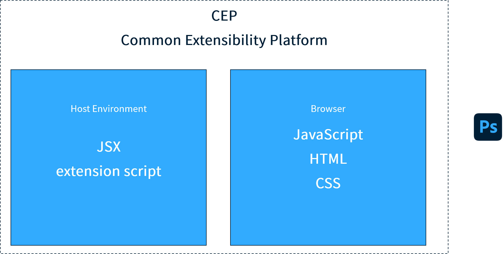
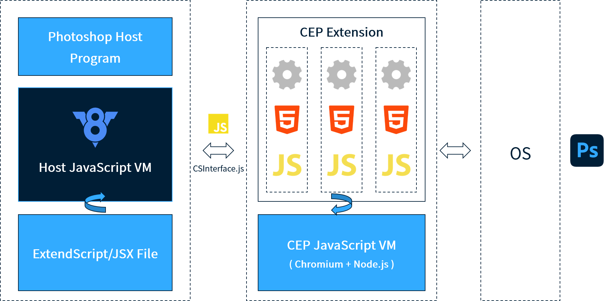

  

# veeui-plugin-photoshop

> A Plugin of PhotoShop for Vee UI Library

## Principle

Similarly, Photoshop also provides its corresponding plug-in mechanism, and the architecture design also adopts the corresponding hierarchical design thinking.

[The VeeUI PhotoShop plugin](https://github.com/vleedesigntheory/veeui-plugin-photoshop) uses a custom development based on the jsx scheme.

## License

[MIT](http://opensource.org/licenses/MIT)

Copyright (c) 2023-present VLeeDesignTheory
